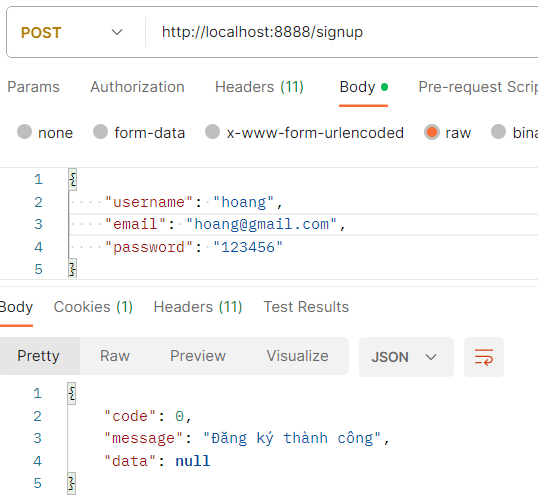
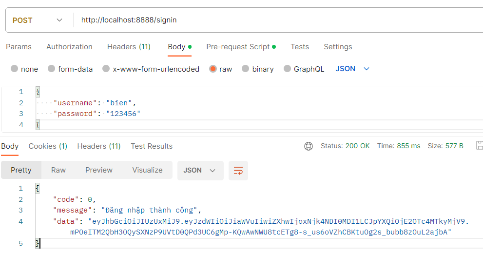
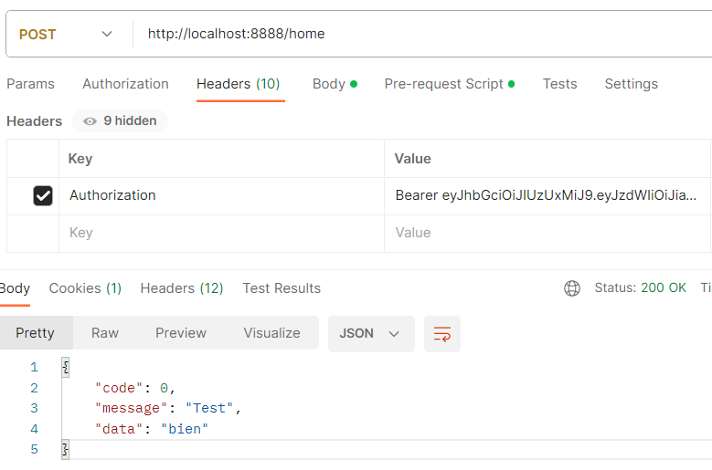

# Getting Started

### API Guide

[POST] /signup

[POST] /signin

Login thành công phía server sẽ trả về cho người dùng jwt, người dùng sẽ lưu lại jwt để lần sau không cần đăng nhập lại nữa và sử dụng để xác thực người khi sử dụng các chức năng khác

Sử dụng jwt để xác thực người dùng bằng cách mỗi request gửi lên sẽ kèm theo Headers có key là Authorization và value là Bearer + token

